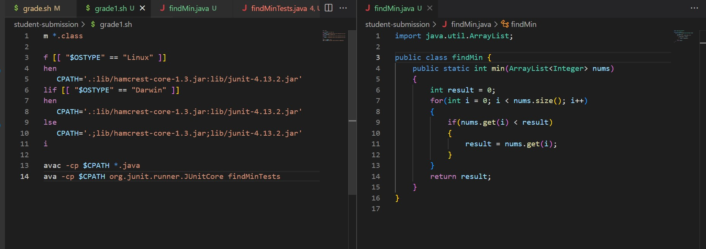
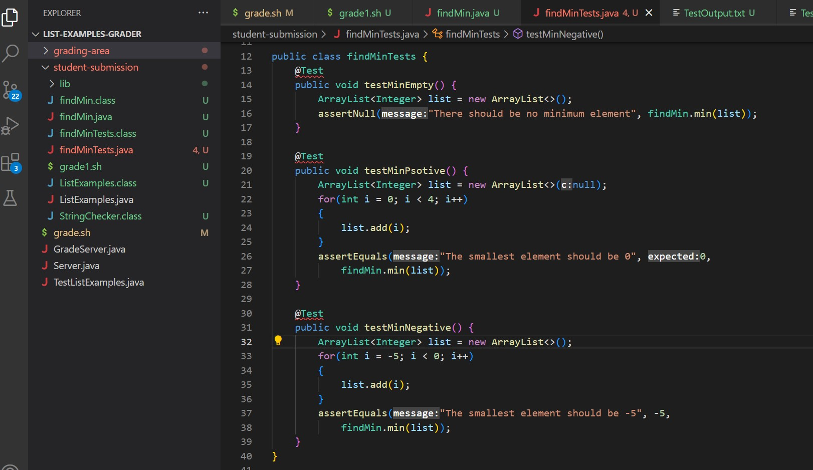
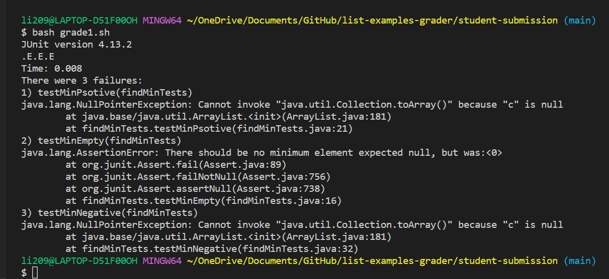
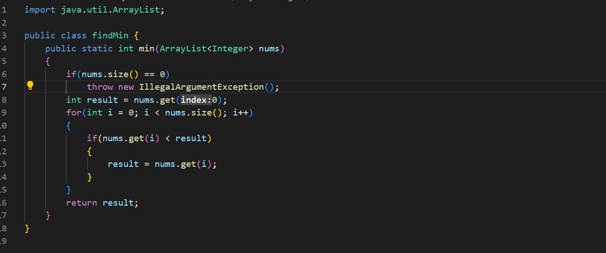
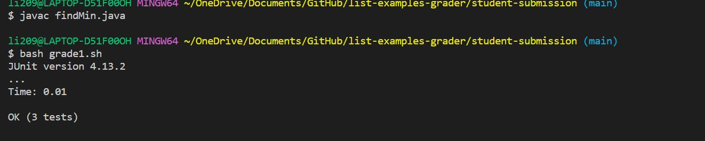

# CS15L-LabReport5
**Part 1 – Debugging Scenario**
**What environment are you using (computer, operating system, web browser, terminal/editor, and so on)?**

*I am using Windows and VSCode for my text editor.*

**Detail the symptom you're seeing. Be specific; include both what you're seeing and what you expected to see instead. Screenshots are great, copy-pasted terminal output is also great. Avoid saying “it doesn't work”.**

*I am writing a static method `min` in the class `findMin`. The method is designed to take an arraylist of integers and multiply return the smallest element. Most of  JUnit test approved my implementation. However, some Junit test shows that the method has wrong output for specific inputs.*

**Detail the failure-inducing input and context. That might mean any or all of the command you're running, a test case, command-line arguments, working directory, even the last few commands you ran. Do your best to provide as much context as you can.**

*This is a screenshot of the method implementation and bash script. The bash script is named `grade1.sh` and the implementation is `findMin.java`.*


*The bash script `grade1.sh` is designed to determine which type of environment for the correct path and compile the Junit test and run it on my implementation. Here is a screen shot of the test cases and the terminal when I run the tests.*



**TA Response**
Hello! I see your implementation passed the postive integer test but failed the empty and negative tests. I think the bug is at line 6 in your min method. The method initially set the minimun to 0. However, it did not consider the cases when a the input list does not contain 0 or 0 is not the minimum. It would be helpful to initialize the result to the first element of the input list and check if the input list is empty! An example of this would be:
````
if(nums.size() == 0)
  throw new IllegalArgumentException();
int result = nums.get(0);
```` 
I hope this was helpful and have a nice day!

**Student Response**
Thank you so much! The suggestions were very helpful! Here is a screenshot of my fixed code!

By fixing this bug, all the test cases passed!


**Part 2 - Reflection**
I learned how to write bash scripts which was amazing! This skill would be useful in so many ways for my future projects. I would save tremandous amount of time by creating a bash script instead of writing in terminal!

